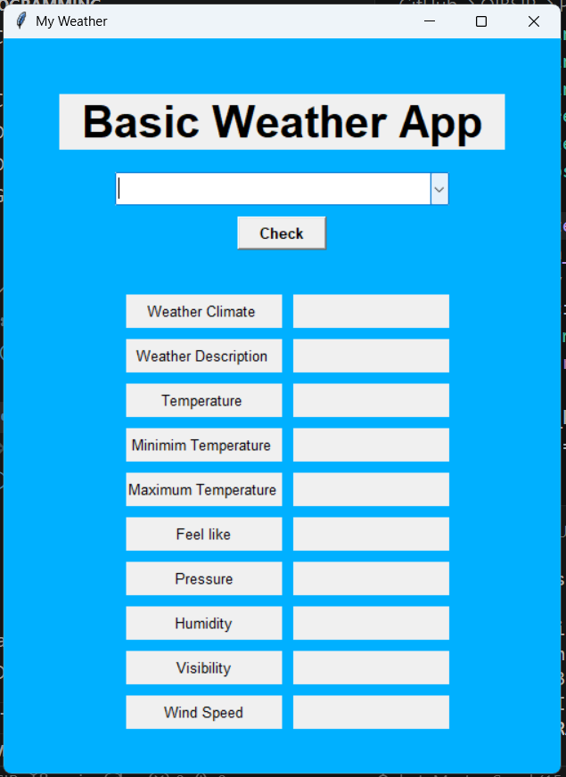
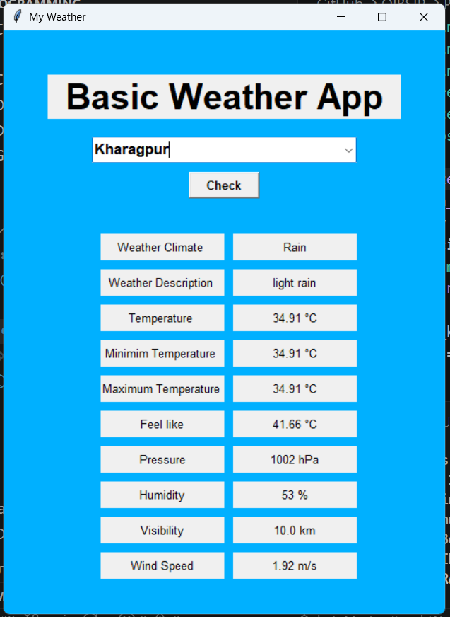
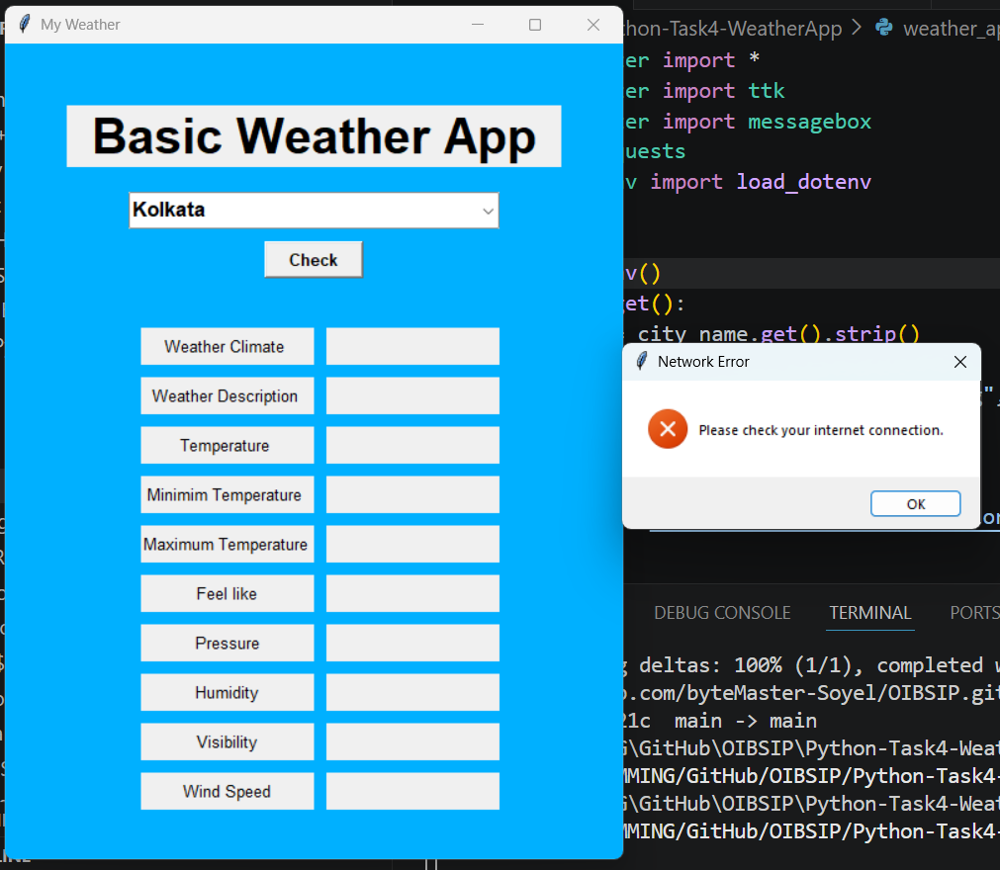

# 🌦️ Weather App

A simple desktop Weather Application developed using **Python** and **Tkinter**. It fetches real-time weather information from the **OpenWeatherMap API** based on the selected Indian city.

---

## 📌 Features

- 🌍 Select an Indian city from a dropdown list
- 🌡️ Display current temperature (°C)
- 🌡️ Show minimum and maximum temperature
- 🤗 Display "Feels Like" temperature
- ☁️ Show weather condition and description
- 💧 Display humidity
- 🌬️ Display wind speed
- 📏 Display visibility (km)
- 🎈 Display atmospheric pressure
- ⚠️ Error handling for invalid requests and network issues

---

## 🛠️ Technologies Used

- Python 3
- Tkinter
- Requests
- OpenWeatherMap API

---

## 📂 Project Structure

```
Python-Task4-WeatherApp/
│
├── weather_app.py
├── requirements.txt
├── .gitignore
├── README.md
└── screenshots/
```

---

## 🚀 Installation

### 1. Clone the repository

```bash

git clone https://github.com/byteMaster-Soyel/OIBSIP.git
```

### 2. Go to the project folder

```bash
cd OIBSIP/Python-Task4-WeatherApp
```

### 3. Install the required package

```bash
pip install -r requirements.txt
```

### 4. Run the application

```bash
python weather_app.py
```

---

## 📸 Screenshots

### 🏠 Home Screen



### 🌤️ Weather Result



### ❌ Error Message


---

## 📖 API Used

This project uses the **OpenWeatherMap API** to retrieve live weather information.

---

## 👨‍💻 Author

**Sk Soyel**

Python Programming Intern – Oasis Infobyte
